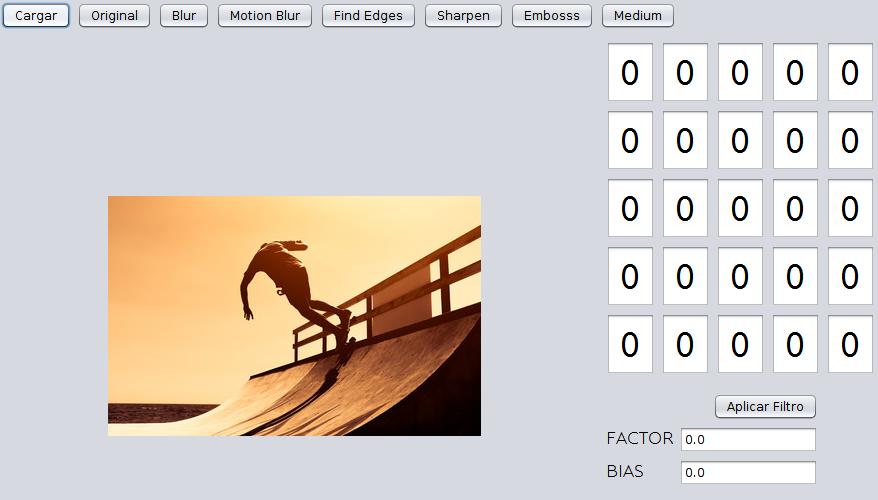
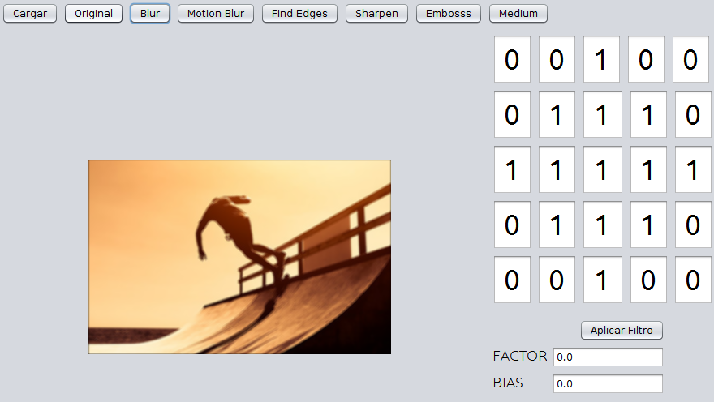
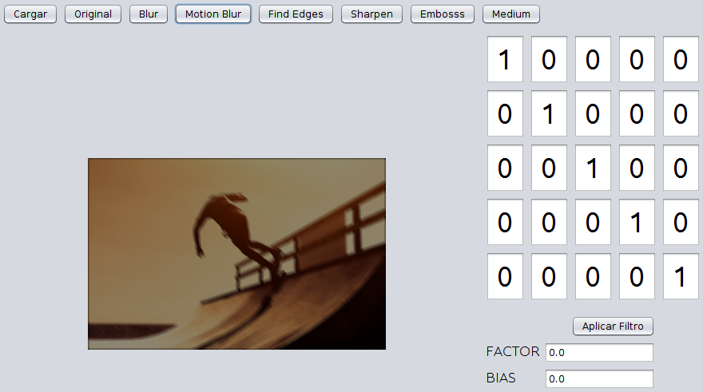
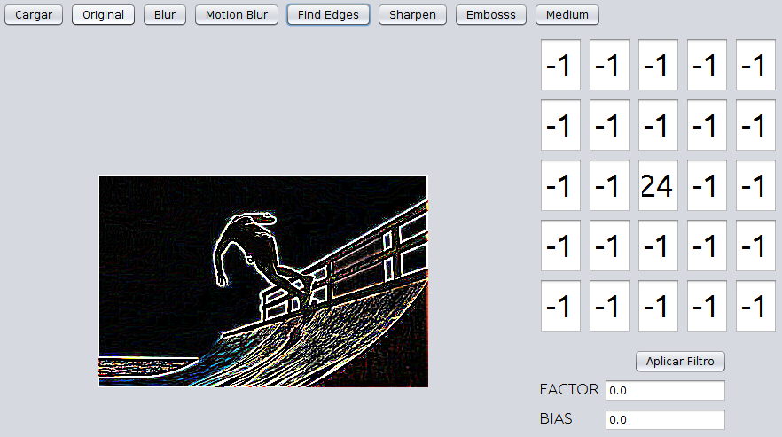
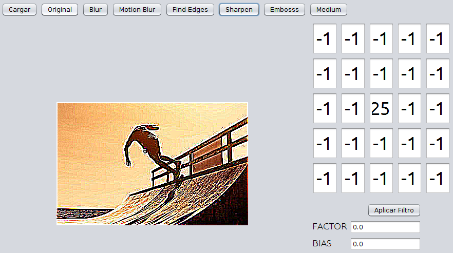
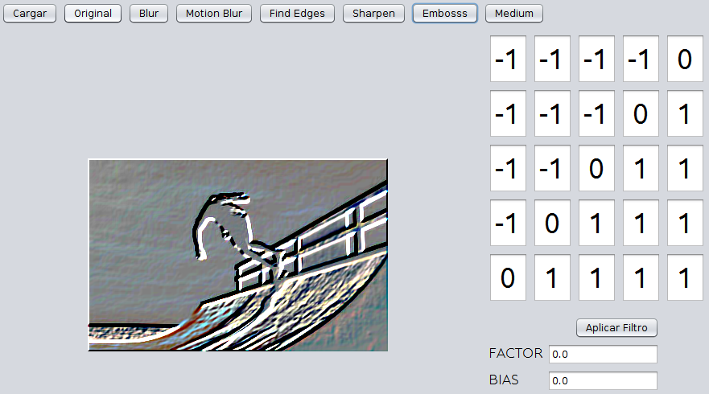

# Matrices de convolución.
## Emmanuel Cruz Hernández.

----

## Descripción
Hay un método principal que se llama _convolution()_. Este es el encargado de aplicar un filtro a una imagen realizando ciertas operaciones a cada pixel con ayuda de una matriz. En la práctica todas las matrices son de 5x5 dfinidas en el código de la clase _ProcesadorC_.

Lo primero que hace este método es crear un arreglo bidimensional, el cuál almacena el color RGB de cada uno de los pixeles de la imagen. Al tener este arreglo se procede a calcular los colores nuevos de cada uno de los pixeles a partir del arreglo auxiliar con los colores obtenidos. El cálculo del nuevo color estará dado por la suma de las multiplicaciones de cada uno de los vecinos por la matriz que aplicará el filtro.

Las matrices están definidas en la clase que contiene estas acciones. Estos colores se van a dividir en tres variables, una para el rojo, otra para el azul y otra para el verde. Al final, la suma obtenida en cada una de estas variables se va a convertir en un color y se lo ponemos al pixel en la posición i,j de la imagen a aplicar el filtro. Al final este método regresa un _BufferedImage_, el cuál nos servirá para ser mostrado en la pantalla de la interfaz gráfica.

Las matrices que tengo son:

* Blur

$
\left(
\begin{array}{lllll}
0 & 0 & 1 & 0 & 0 \\
0 & 1 & 1 & 1 & 0 \\
1 & 1 & 1 & 1 & 1 \\
0 & 1 & 1 & 1 & 0 \\
0 & 0 & 1 & 0 & 0
\end{array}
\right)
$

* MotionBlur

$
\left(
\begin{array}{lllll}
1 & 0 & 0 & 0 & 0 \\
0 & 1 & 0 & 0 & 0 \\
0 & 0 & 1 & 0 & 0 \\
0 & 0 & 0 & 1 & 0 \\
0 & 0 & 0 & 0 & 1
\end{array}
\right)
$

* Edges

$
\left(
\begin{array}{lllll}
-1 & -1 & -1 & -1 & -1 \\
-1 & -1 & -1 & -1 & -1 \\
-1 & -1 & 24 & -1 & -1 \\
-1 & -1 & -1 & -1 & -1 \\
-1 & -1 & -1 & -1 & -1
\end{array}
\right)
$

* Sharpen

$
\left(
\begin{array}{lllll}
-1 & -1 & -1 & -1 & -1 \\
-1 & -1 & -1 & -1 & -1 \\
-1 & -1 & 25 & -1 & -1 \\
-1 & -1 & -1 & -1 & -1 \\
-1 & -1 & -1 & -1 & -1
\end{array}
\right)
$

* Emboss1

$
\left(
\begin{array}{lllll}
-1 & -1 & -1 & -1 & 0 \\
-1 & -1 & -1 & 0 & -1 \\
-1 & -1 & 0 & -1 & -1 \\
-1 & 0 & -1 & -1 & -1 \\
0 & -1 & -1 & -1 & -1
\end{array}
\right)
$

Por cada una de las matrices tengo un método que aplica convolution a la matriz específicada, fijando el factor y el bios según la página vista en la clase y en la cuál se basaron los filtros de esta tarea. [https://lodev.org/cgtutor/filtering.html](https://lodev.org/cgtutor/filtering.html)

Finalmente, agregué un método extra que dadas las entradas de la matriz, aplica el filtro convolution usando dicha matriz. Además, se pueden agregar valores para el factor y para bios respectivamente. Al agregar estos valores en cada una de las entradas de la matriz, factor y bios, se debe presionar el boton "Aplicar Filtro".

----

### PASOS PARA COMPILAR Y EJECUTAR EL PROYECTO
1. Abrir la terminal en el proyecto al nivel del archivo _build.xml_.
2. Ingresar los comandos
	* ant jar
	* ant run
3. De inmediato aparecerá la interfaz gráfica en ejecución lista para aplicar filtros.
